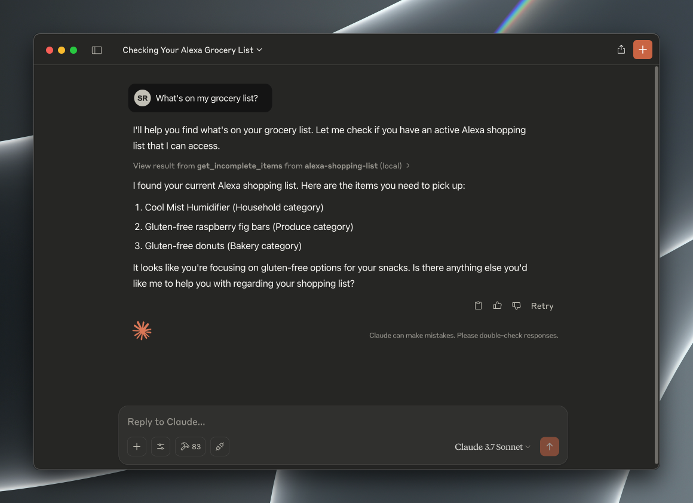

# Alexa Shopping List



## About

Seamlessly manage your Alexa shopping list. Add, remove, and view items instantly.
Interact with your Alexa shopping list via MCP, using AI assistants like Claude or Cursor.

> [!WARNING]
> **Requires Manual Authentication & Cookie Refresh**
>
> This tool uses browser cookies extracted via a manual login process.
> Amazon sessions expire.
> You **will** need to re-run the login script periodically (Step 5 & 6) when the tool stops working.

## Components

1.  **API Server (`src/api`):** Docker container (FastAPI) talking to Alexa.
2.  **MCP Server (`src/mcp`):** Local script providing MCP tools. Proxies to the API server.
3.  **Login Script (`src/auth`):** Local script using Selenium for login and cookie injection.

## Prerequisites

- Python 3.10+
- `uv` (Install: `pip install uv` or see [astral.sh/uv](https://astral.sh/uv))
- Docker & Docker Compose (or Docker Desktop)
- Google Chrome (for login script)
- Amazon Account (with Alexa)

## Setup & Run

**1. Clone Repository**

```bash
# git clone <repository_url>
cd alexa-mcp
```

**2. Configure Components**

Adjust settings in the `config.py` file within each component directory:

- `src/api/config.py`: API server settings (port, internal paths).
- `src/auth/config.py`: Login script settings (Amazon URL, API location, **EMAIL/PASSWORD**).
- `src/mcp/config.py`: MCP server settings (API location).

*Ensure `AMAZON_URL` matches your region and **set your `AMAZON_EMAIL` and `AMAZON_PASSWORD` in `src/auth/config.py`**.* You only need to set these temporarily for the login script to know which Amazon URL to open; the script no longer uses them automatically.

**3. Start API Server Container**

Builds the image and runs the API server in the background.

```bash
docker compose up --build -d alexa_api
```

*(Use `docker compose logs -f alexa_api` to view logs; `docker compose down` to stop.)*

**4. Set Up Local Environment & Install Auth Dependencies**

```bash
# In the project root (alexa-mcp)
uv venv
source .venv/bin/activate
uv pip install -r src/auth/requirements.txt
```

**5. Run Login Script**

This opens a browser window to the Amazon sign-in page.

```bash
# Ensure virtual env is active
python -m src.auth.login
```

**6. Manual Login & Confirmation**

Log in manually using the browser window opened by the script. Handle any 2FA or CAPTCHA steps presented by Amazon.

Once you are successfully logged into Amazon in that browser window, return to the terminal where you ran the script and press `ENTER`.

The script will then attempt to extract the session cookies and send them to the API server.

**7. Test API**

Verify the API server received the cookies and can access your list by opening this URL in your browser (or using `curl`):

[http://127.0.0.1:8000/items/all](http://127.0.0.1:8000/items/all)

You should see a JSON response containing your current Alexa shopping list items. If you get an error (like 401 Unauthorized or 503 Service Unavailable), check the API logs (`docker compose logs alexa_api`) and potentially rerun steps 5 & 6.

*   **API Documentation:** FastAPI automatically generates interactive documentation. You can explore all available endpoints and test them directly in your browser at [http://127.0.0.1:8000/docs](http://127.0.0.1:8000/docs).

## Troubleshooting

- **MCP Server Issues:**
    - `spawn ENOENT` (Claude Desktop): Verify absolute paths in `mcp.json`.
    - Connection Errors/Disconnects: Check API container logs (`docker compose logs alexa_api`). Ensure API container is running and accessible (check `src/mcp/config.py`).
    - Import Errors: Ensure dependencies installed in the correct venv (`uv pip install -r src/mcp/requirements.txt`).
- **API Container Issues:**
    - Startup Failure: Check logs (`docker compose logs alexa_api`).
    - Config Errors: Verify settings in `src/api/config.py`.
    - Port Conflicts: Ensure host port `8000` (or mapped port) is free.
- **Login Script Issues (`src/auth/login.py`):**
    - Import Errors: Ensure dependencies installed (`uv pip install -r src/auth/requirements.txt`).
    - `ModuleNotFoundError: No module named 'distutils'` (on Python 3.12+): Ensure `setuptools` is included in `src/auth/requirements.txt` and dependencies are reinstalled.
    - WebDriver Errors: Ensure Chrome is installed/updated. Check `nodriver` compatibility.
    - Cookie Errors: Occurs if login fails or cookies cannot be extracted after successful login.
    - API Connection Error: Ensure API container is running and reachable (check `src/auth/config.py`). Check `docker compose logs alexa_api`.
    - Login Failures: Verify credentials in `src/auth/config.py`. Check for unexpected page changes or Captcha/2FA prompts mentioned in logs or screenshots. Amazon might change selectors (`#ap_email`, `#signInSubmit`, etc.).
- **Tool Errors (401 Unauthorized):** Login failed or cookies expired. Rerun the login script (`python -m src.auth.login`). Ensure credentials in `src/auth/config.py` are correct and check `auth` logs for any 2FA/Captcha issues during the last run.

## Connecting an MCP Client (Claude Desktop / Cursor)

To use this server with an MCP client like Claude Desktop or Cursor, you need to add its configuration to your client's `mcp.json` file. This file tells the client how to find and run your local MCP server.

1.  Locate your MCP client's configuration file (often named `mcp.json`). The location varies depending on the client.
2.  Open the file and add the following entry within the main `"mcpServers": { ... }` object:

```json
    "alexa-shopping-list": {
        "displayName": "Alexa Shopping List MCP",
        "description": "MCP Server for interacting with Alexa shopping list via local API",
        "command": "/path/to/your/alexa-mcp/.venv/bin/python",
        "args": [
          "-m",
          "src.mcp.mcp_server"
        ],
        "workingDirectory": "/path/to/your/alexa-mcp",
        "env": {
          "PYTHONPATH": "/path/to/your/alexa-mcp"
        }
    }
```

**IMPORTANT:**

*   You **MUST** replace the placeholder absolute paths `/path/to/your/alexa-mcp` in the `command`, `workingDirectory`, and `env.PYTHONPATH` fields with the actual absolute path to **your** project directory on your machine.
*   Ensure the `.venv` virtual environment exists at that location and has the MCP dependencies installed (`uv pip install -r src/mcp/requirements.txt`).

3.  Save the `mcp.json` file.
4.  Restart your MCP client. The "Alexa Shopping List MCP" server should now be available.

## Sponsorship

Like this tool? Consider sponsoring the developer:

[](https://github.com/sponsors/TheSethRose)
